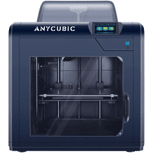

# Marlin 3D Printer Firmware

Version for Anycubic 4max pro 2

## License

Marlin is published under the [GPL license](https://github.com/COPYING.md) because we believe in open development. The GPL comes with both rights and obligations. Whether you use Marlin firmware as the driver for your open or closed-source product, you must keep Marlin open, and you must provide your compatible Marlin source code to end users upon request. The most straightforward way to comply with the Marlin license is to make a fork of Marlin on Github, perform your modifications, and direct users to your modified fork.

While we can't prevent the use of this code in products (3D printers, CNC, etc.) that are closed source or crippled by a patent, we would prefer that you choose another firmware or, better yet, make your own.

